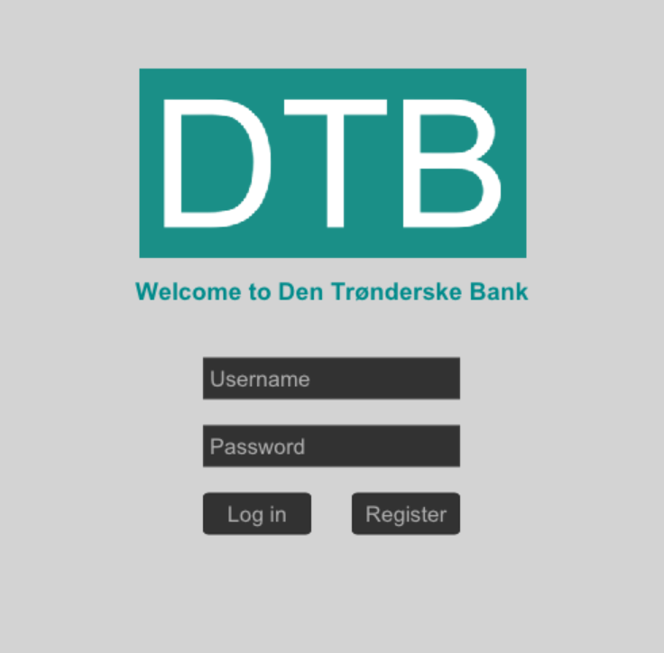

# DTB - Den Trønderske Bank

Course project for TDT4102: Prosedyre- og objektorientert programmering (C++)

A simple banking simulator where users can register, log in, create checking and savings accounts 
and deposit, withdraw and transfer funds through a GUI. Data is saved between sessions.



## Features
- **Users:** Registration and login with input validation
- **Accounts:** Savings accounts (with interest) and checking accounts (with overdraft limits)
- **Transactions:** Deposit, withdraw and transfer
- **Persistence:** Users, accounts and the transaction log are stored as CSV files and reloaded when the program starts
- **GUI:** Login, dashboard and account-creation screens with error and status messages. Uses AnimationWindow library

## Technical highlights
- **OOP:** An abstract class `BankAccount` with `SavingsAccount` and `CheckingAccount` overriding rules for withdrawing through polymorphism
- **Encapsulation:** Balances can only be changed through the `Ledger`, and account setters are private and exposed only to Ledger via `friend`
- **Safe money handling:** Amounts are stored in cents/øre as `long long` to avoid float errors
- **Error handling:** Custom exceptions that the GUI catches and shows the user (for example `InsufficientFunds` or `UserAlreadyExists`)

## Project structure
```
core/           Ledger, transactions, users and serialization
core/accounts/  BankAccount and its subclasses
exceptions/     Custom exceptions
gui/            Login, dashboard and create-account screens
main.cpp        Screen navigation loop
```

## Build and run
Requirements:
- C++23 compiler
- Meson
```bash
meson setup build
meson compile -C build
./build/program   # run from the project root
```